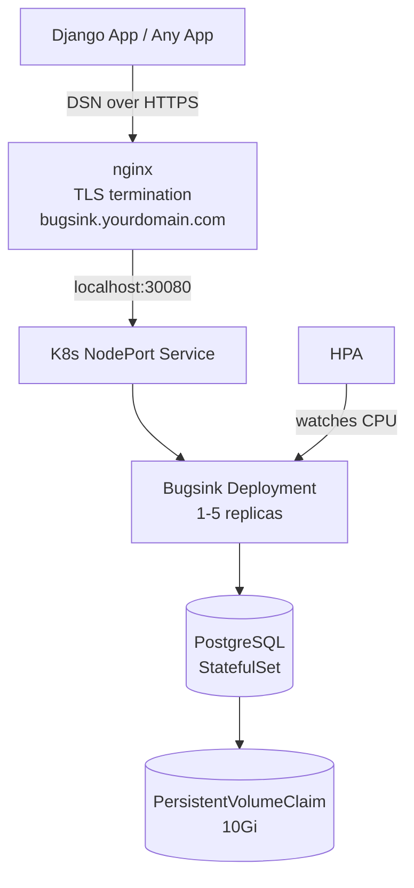
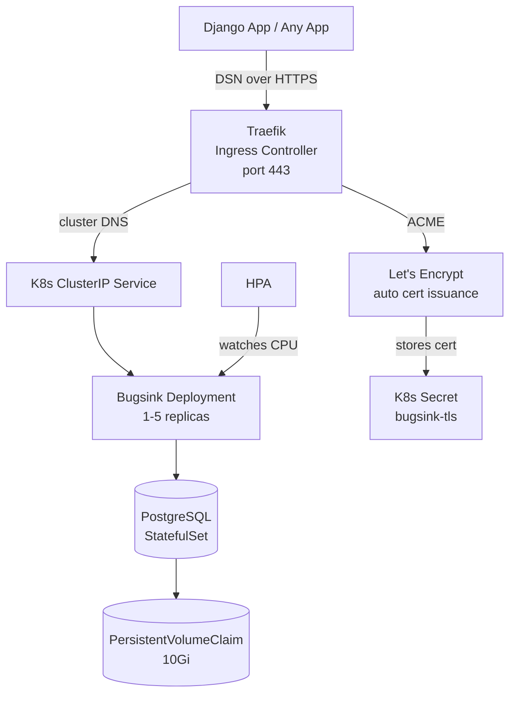
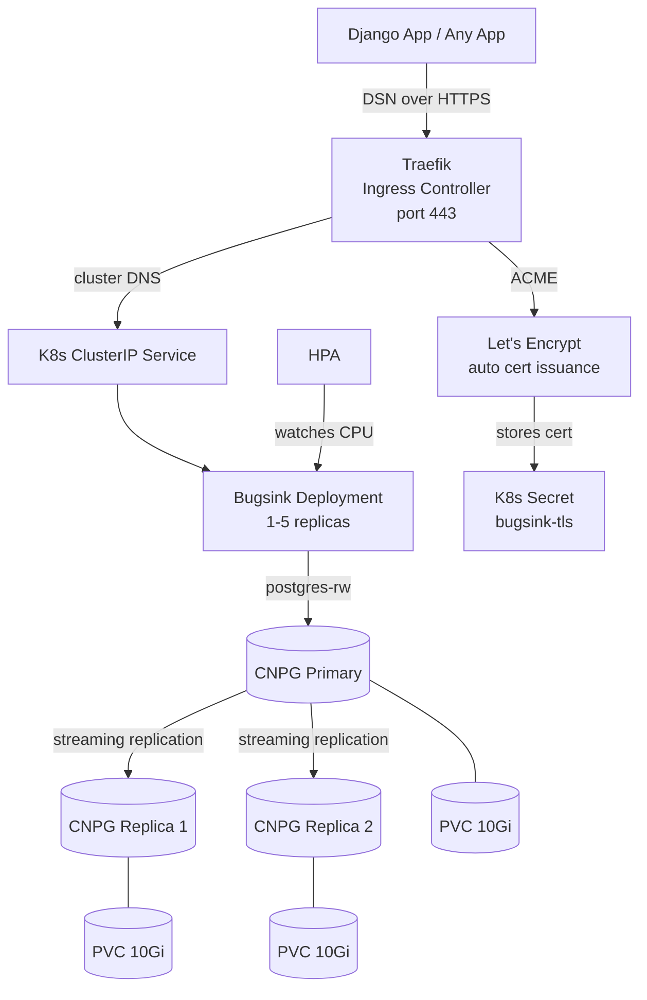

# Bugsink Hosted

Self-hosted error tracking using [Bugsink](https://www.bugsink.com), deployed on Kubernetes with PostgreSQL persistence, horizontal autoscaling, and three production deployment options.

## Architecture

**Option A — nginx (NodePort)**


**Option B — Traefik (Ingress + StatefulSet Postgres)**


**Option C — Traefik (Ingress + CloudNativePG HA Postgres)**


## What This Does

- Runs Bugsink (`bugsink/bugsink:2`) inside Kubernetes with a dedicated PostgreSQL instance
- PostgreSQL data is persisted via a `PersistentVolumeClaim` — survives pod restarts and rescheduling
- Bugsink scales horizontally (1–5 replicas) via a `HorizontalPodAutoscaler` based on CPU usage
- Three production options: nginx on the host (NodePort), Traefik in-cluster (Ingress + Let's Encrypt), or Traefik + CloudNativePG for HA Postgres with streaming replication and automatic failover
- Kustomize components separate postgres implementations so each overlay picks its own backend — StatefulSet for Options A/B, CNPG for Option C

## File Structure

```
Makefile
k8s/
├── base/                          # shared across all environments
│   ├── kustomization.yaml
│   ├── 00-namespace.yaml
│   ├── 01-bugsink-configmap.yaml
│   ├── 02-bugsink-deployment.yaml
│   ├── 03-bugsink-service.yaml
│   └── 04-bugsink-hpa.yaml
├── components/                    # pluggable postgres backends
│   ├── postgres-statefulset/      # single-replica postgres (Options A + B)
│   │   ├── kustomization.yaml
│   │   ├── postgres-statefulset.yaml
│   │   └── postgres-service.yaml
│   └── postgres-cnpg/             # CloudNativePG HA cluster (Option C)
│       ├── kustomization.yaml
│       └── postgres-cluster.yaml
└── overlays/
    ├── local/                     # minikube / local testing
    │   ├── kustomization.yaml
    │   ├── configmap-patch.yaml
    │   └── secrets/               # git-ignored, local credentials
    │       ├── postgres.env
    │       └── bugsink.env
    ├── production/                # nginx + NodePort (Option A)
    │   ├── kustomization.yaml
    │   ├── configmap-patch.yaml
    │   └── secrets/               # git-ignored, production credentials
    │       ├── postgres.env
    │       └── bugsink.env
    ├── production-traefik/        # Traefik + StatefulSet Postgres (Option B)
    │   ├── kustomization.yaml
    │   ├── configmap-patch.yaml
    │   ├── service-patch.yaml     # patches NodePort → ClusterIP
    │   ├── ingress.yaml           # Traefik Ingress with ACME cert resolver
    │   └── secrets/               # git-ignored, production credentials
    │       ├── postgres.env
    │       └── bugsink.env
    └── production-cnpg/           # Traefik + CloudNativePG HA (Option C)
        ├── kustomization.yaml
        ├── configmap-patch.yaml
        ├── service-patch.yaml     # patches NodePort → ClusterIP
        ├── ingress.yaml           # Traefik Ingress with ACME cert resolver
        ├── deployment-patch.yaml  # redirects DATABASE_URL to postgres-rw
        └── secrets/               # git-ignored, production credentials
            ├── postgres.env
            └── bugsink.env
```

## Local Testing with Minikube

### Prerequisites

- [minikube](https://minikube.sigs.k8s.io/docs/start/)
- kubectl
- make

### Setup

```bash
# Start minikube
minikube start --memory=2048 --cpus=2

# Enable metrics-server (required for HPA)
minikube addons enable metrics-server
```

### Configure local overlay

Edit `k8s/overlays/local/configmap-patch.yaml`:

```yaml
BEHIND_HTTPS_PROXY: "False"
BASE_URL: "http://<minikube-ip>:30080"   # get IP with: minikube ip
```

Create `k8s/overlays/local/secrets/postgres.env`:
```
POSTGRES_USER=bugsink
POSTGRES_PASSWORD=localpassword
POSTGRES_DB=bugsink
```

Create `k8s/overlays/local/secrets/bugsink.env`:
```
SECRET_KEY=any-local-dev-key
CREATE_SUPERUSER=admin@example.com:admin
```

### Deploy

```bash
make deploy-local
make watch          # wait for pods to be Running
make minikube-url   # get the URL to open in browser
```

### Making Local Bugsink Reachable from Docker Containers

By default, Docker containers cannot reach the minikube IP (`192.168.49.2`) because they run on an isolated bridge network. To send error events from a Dockerised app to local Bugsink:

**Option A — host-gateway (recommended)**

Add to your app's `docker-compose.yml`:
```yaml
services:
  your-app:
    extra_hosts:
      - "host.docker.internal:host-gateway"
```

Set your DSN to use `host.docker.internal`:
```
BUGSINK_DSN=http://<key>@host.docker.internal:30080/1
```

**Option B — ngrok tunnel**

```bash
ngrok http <minikube-ip>:30080
```

Use the ngrok `https://` URL as your DSN host. Also update `BASE_URL` in the local overlay to the ngrok URL and set `BEHIND_HTTPS_PROXY: "True"` since ngrok acts as an HTTPS proxy.

> Note: ngrok free tier URLs change on every restart.

## Production Deployment

### Option A — nginx (NodePort)

Use this when nginx is already running on the server and handling other sites.

**Checklist:**
- [ ] Domain DNS A record points to your server IP
- [ ] Certbot has issued certificates: `/etc/letsencrypt/live/bugsink.yourdomain.com/`
- [ ] `k8s/overlays/production/configmap-patch.yaml` has correct `BASE_URL`
- [ ] `k8s/overlays/production/secrets/` populated with strong credentials
- [ ] `overlays/*/secrets/` is in `.gitignore`
- [ ] metrics-server is installed on the cluster

**`secrets/postgres.env`:**
```
POSTGRES_USER=bugsink
POSTGRES_PASSWORD=<strong-password>
POSTGRES_DB=bugsink
```

**`secrets/bugsink.env`:**
```
SECRET_KEY=<50-char-random-string>
CREATE_SUPERUSER=admin@yourdomain.com:<password>
```

**nginx server block:**

```nginx
server {
    listen 443 ssl;
    server_name bugsink.yourdomain.com;

    ssl_certificate /etc/letsencrypt/live/bugsink.yourdomain.com/fullchain.pem;
    ssl_certificate_key /etc/letsencrypt/live/bugsink.yourdomain.com/privkey.pem;

    location / {
        proxy_pass http://localhost:30080;
        proxy_set_header Host $host;
        proxy_set_header X-Forwarded-Proto https;
        proxy_set_header X-Real-IP $remote_addr;
    }
}
```

**Deploy:**
```bash
make deploy-prod
make watch
make pvc
make hpa
```

---

### Option B — Traefik (Ingress + StatefulSet Postgres)

Use this when Traefik is running as the cluster ingress controller. Traefik handles TLS automatically via Let's Encrypt — no Certbot needed. Postgres runs as a single-replica StatefulSet.

**Checklist:**
- [ ] Domain DNS A record points to your server IP
- [ ] Traefik is deployed with a `certificatesResolvers.letsencrypt` block in its static config
- [ ] Port 80 is open on the server (Let's Encrypt HTTP challenge)
- [ ] `k8s/overlays/production-traefik/ingress.yaml` has correct domain
- [ ] `k8s/overlays/production-traefik/configmap-patch.yaml` has correct `BASE_URL`
- [ ] `k8s/overlays/production-traefik/secrets/` populated with strong credentials
- [ ] `overlays/*/secrets/` is in `.gitignore`
- [ ] metrics-server is installed on the cluster

**`secrets/postgres.env`:**
```
POSTGRES_USER=bugsink
POSTGRES_PASSWORD=<strong-password>
POSTGRES_DB=bugsink
```

**`secrets/bugsink.env`:**
```
SECRET_KEY=<50-char-random-string>
CREATE_SUPERUSER=admin@yourdomain.com:<password>
```

**How Traefik issues the cert automatically:**

```
kubectl apply -k k8s/overlays/production-traefik/
  → Traefik sees the Ingress resource
  → contacts Let's Encrypt ACME API
  → Let's Encrypt validates via HTTP challenge on port 80
  → cert issued and stored as K8s Secret "bugsink-tls"
  → HTTPS starts working
```

Verify the cert was issued:
```bash
kubectl get secret bugsink-tls -n bugsink
```

**Deploy:**
```bash
make deploy-prod-traefik
make watch
make pvc
make hpa
```

---

### Option C — Traefik + CloudNativePG (HA Postgres)

Use this when you want high-availability Postgres with streaming replication and automatic failover. CNPG runs 3 Postgres instances (1 primary + 2 replicas) and manages failover automatically. Requires the CNPG operator installed once per cluster.

**How CNPG names its services**

When the CNPG operator processes a `Cluster` resource named `postgres`, it automatically creates three Kubernetes Services:

| Service | Routes to | Purpose |
|---|---|---|
| `postgres-rw` | primary only | all writes — what Bugsink uses |
| `postgres-ro` | replicas only | read-heavy queries |
| `postgres-r` | any instance | random reads |

These are always named `<cluster-name>-rw`, `<cluster-name>-ro`, `<cluster-name>-r`. Since the cluster is named `postgres`, Bugsink connects to `postgres-rw`. You can verify after deploying:
```bash
kubectl get svc -n bugsink | grep postgres
```

**Install CNPG operator (once per cluster):**
```bash
kubectl apply -f https://raw.githubusercontent.com/cloudnative-pg/cloudnative-pg/release-1.25/releases/cnpg-1.25.0.yaml
```

**Checklist:**
- [ ] CNPG operator installed on the cluster (see above)
- [ ] Domain DNS A record points to your server IP
- [ ] Traefik is deployed with a `certificatesResolvers.letsencrypt` block in its static config
- [ ] Port 80 is open on the server (Let's Encrypt HTTP challenge)
- [ ] `k8s/overlays/production-cnpg/ingress.yaml` has correct domain
- [ ] `k8s/overlays/production-cnpg/configmap-patch.yaml` has correct `BASE_URL`
- [ ] `k8s/overlays/production-cnpg/secrets/` populated with strong credentials
- [ ] `overlays/*/secrets/` is in `.gitignore`
- [ ] metrics-server is installed on the cluster

**`secrets/postgres.env`** — requires two sets of keys:
```
# For CNPG bootstrap: sets the password for the 'bugsink' database owner
username=bugsink
password=<strong-password>

# For Bugsink deployment: used to compose DATABASE_URL
POSTGRES_USER=bugsink
POSTGRES_PASSWORD=<strong-password>
POSTGRES_DB=bugsink
```

> `username`/`password` are the key names CNPG expects when reading the bootstrap secret. `POSTGRES_USER`/`POSTGRES_PASSWORD`/`POSTGRES_DB` are the keys the Bugsink deployment reads to build its `DATABASE_URL`. Both sets must match.

**`secrets/bugsink.env`:**
```
SECRET_KEY=<50-char-random-string>
CREATE_SUPERUSER=admin@yourdomain.com:<password>
```

**Deploy:**
```bash
make deploy-prod-cnpg
make watch
kubectl get cluster -n bugsink     # CNPG Cluster status: Healthy
make pvc                           # 3 PVCs, one per CNPG instance
make hpa
```

## Makefile Reference

| Command | Description |
|---|---|
| `make deploy-local` | Deploy to local cluster + restart bugsink |
| `make deploy-prod` | Deploy to production (nginx + NodePort) |
| `make deploy-prod-traefik` | Deploy to production (Traefik + StatefulSet Postgres) |
| `make deploy-prod-cnpg` | Deploy to production (Traefik + CloudNativePG HA) |
| `make diff-local` | Preview local changes before applying |
| `make diff-prod` | Preview production nginx changes before applying |
| `make diff-prod-traefik` | Preview production Traefik changes before applying |
| `make diff-prod-cnpg` | Preview production CNPG changes before applying |
| `make status` | Show all resources in namespace |
| `make watch` | Watch pods update in real time |
| `make logs` | Snapshot bugsink logs |
| `make logs-follow` | Live tail bugsink logs |
| `make logs-all` | Live tail including init container |
| `make logs-pod POD=<name>` | Logs for a specific pod |
| `make logs-postgres` | Live tail postgres logs |
| `make pvc` | Check postgres volume is Bound |
| `make hpa` | Check autoscaler status |
| `make minikube-url` | Print local service URL |
| `make teardown` | Delete everything including PVCs |
| `make teardown-pvc` | Delete only the postgres volume |

## Debugging CSRF Issues

CSRF errors are the most common issue when setting up a reverse proxy in front of Bugsink. Bugsink ships with a verbose CSRF middleware that shows detailed error messages including the exact headers Django received — use that output to diagnose misconfigured proxy headers.

For nginx, ensure these three headers are forwarded:

```nginx
proxy_set_header Host $host;
proxy_set_header X-Forwarded-Proto https;
proxy_set_header X-Real-IP $remote_addr;
```

And set `BEHIND_HTTPS_PROXY: "True"` in your overlay's `configmap-patch.yaml` so Django trusts those headers.

> Note: You never need to set `CSRF_TRUSTED_ORIGINS` with Bugsink — it is not required and should be left unset.

### Advanced CSRF debugging tool

If the verbose error message isn't enough, Bugsink has a built-in CSRF debugging tool. It is disabled by default for security reasons.

To enable it, add `DEBUG_CSRF` to your overlay's `configmap-patch.yaml`:

```yaml
data:
  BEHIND_HTTPS_PROXY: "True"
  BASE_URL: "https://bugsink.yourdomain.com"
  DEBUG_CSRF: "True"
```

Redeploy, then visit `https://bugsink.yourdomain.com/debug/csrf/` and press the button to get a full report of what headers and checks Django is seeing.

Disable it again once you're done — remove `DEBUG_CSRF` from the configmap and redeploy.

**For local testing with ngrok**, enable it in the local overlay:

```yaml
data:
  BEHIND_HTTPS_PROXY: "True"
  BASE_URL: "https://<your-ngrok-url>"
  DEBUG_CSRF: "True"
```

---

## Integrating with Your App

Bugsink is compatible with the Sentry SDK. Get your DSN from the Bugsink UI after creating a project.

```python
import sentry_sdk

sentry_sdk.init(
    dsn=BUGSINK_DSN,          # read from env var
    # DjangoIntegration is auto-enabled when Django is detected.
    # Add it explicitly only if you need to customise its options:
    # from sentry_sdk.integrations.django import DjangoIntegration
    # integrations=[DjangoIntegration()],
    send_default_pii=True,
    traces_sample_rate=0,     # Bugsink doesn't support tracing
    send_client_reports=False,
    auto_session_tracking=False,
)
```
