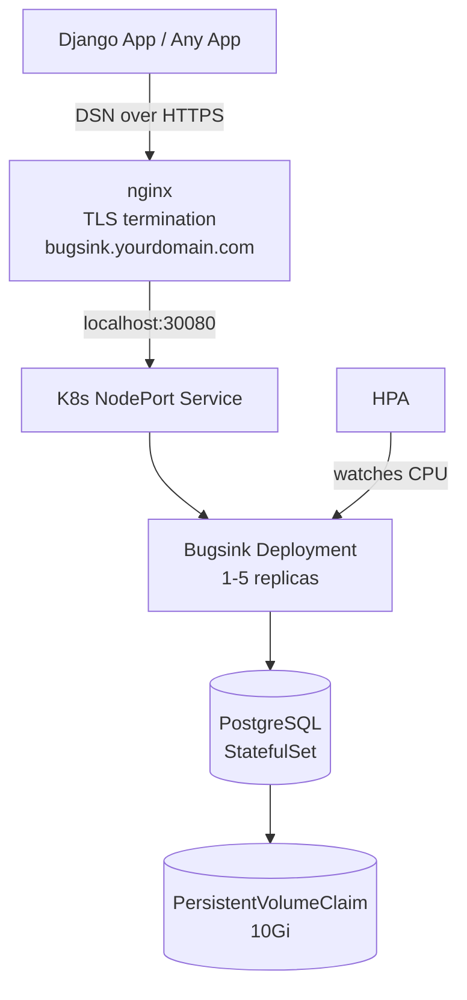
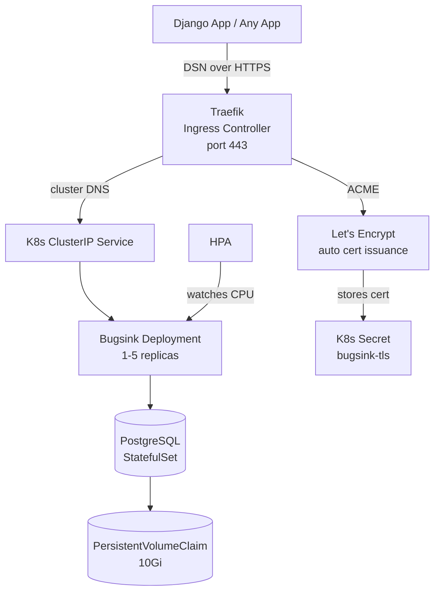
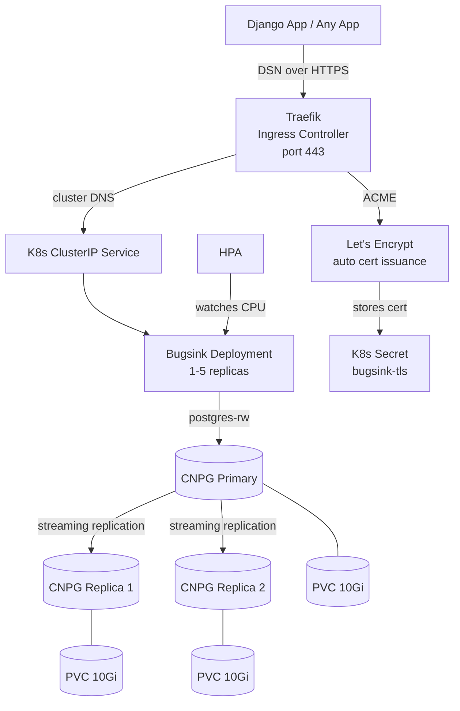

# Bugsink Hosted

Self-hosted error tracking using [Bugsink](https://www.bugsink.com), deployed on Kubernetes with PostgreSQL persistence, horizontal autoscaling, and three production deployment options.

## Architecture

**Option A — nginx (NodePort)**


**Option B — Traefik (Ingress + StatefulSet Postgres)**


**Option C — Traefik (Ingress + CloudNativePG HA Postgres)**


## Pre-rendered Manifests

Each GitHub release includes three ready-to-apply YAML files — one per deployment option. Download the one you need, replace the placeholder values, and apply it directly without needing Kustomize or cloning the repo.

| File | Option |
|---|---|
| `bugsink-local.yaml` | Local / Minikube (testing) |
| `bugsink-nginx.yaml` | nginx + NodePort (Option A) |
| `bugsink-traefik.yaml` | Traefik + StatefulSet Postgres (Option B) |
| `bugsink-cnpg.yaml` | Traefik + CloudNativePG HA (Option C) |
| `bugsink-cnpg-restore.yaml` | CNPG data recovery template (Option C only) |

Every file has a comment block at the top listing exactly which values to replace before applying:

```bash
# Download
curl -LO https://github.com/<you>/bugsink-hosted/releases/latest/download/bugsink-cnpg.yaml

# Replace placeholders (example with sed)
sed -i \
  -e 's/CHANGEME_POSTGRES_PASSWORD/your-strong-password/g' \
  -e 's/CHANGEME_SECRET_KEY_MIN_50_CHARS/your-50-char-key/g' \
  -e 's/CHANGEME_ADMIN_PASSWORD/your-admin-password/g' \
  bugsink-cnpg.yaml

# Apply
kubectl apply -f bugsink-cnpg.yaml
```

Artifacts are rebuilt automatically when their source files change — a change to `k8s/overlays/production-cnpg/` only rebuilds `bugsink-cnpg.yaml`. Tagged releases always rebuild all three.

---

## What This Does

- Runs Bugsink (`bugsink/bugsink:2`) inside Kubernetes with a dedicated PostgreSQL instance
- PostgreSQL data is persisted via a `PersistentVolumeClaim` — survives pod restarts and rescheduling
- Bugsink scales horizontally (1–5 replicas) via a `HorizontalPodAutoscaler` based on CPU usage
- Three production options: nginx on the host (NodePort), Traefik in-cluster (Ingress + Let's Encrypt), or Traefik + CloudNativePG for managed Postgres with backups, PITR, and optional HA replication across multiple nodes
- Kustomize components separate postgres implementations so each overlay picks its own backend — StatefulSet for Options A/B, CNPG for Option C

## File Structure

```
Makefile
k8s/
├── base/                          # shared across all environments
│   ├── kustomization.yaml
│   ├── 00-namespace.yaml
│   ├── 01-bugsink-configmap.yaml
│   ├── 02-bugsink-deployment.yaml
│   ├── 03-bugsink-service.yaml
│   └── 04-bugsink-hpa.yaml
├── components/                    # pluggable postgres backends
│   ├── postgres-statefulset/      # single-replica postgres (Options A + B)
│   │   ├── kustomization.yaml
│   │   ├── postgres-statefulset.yaml
│   │   └── postgres-service.yaml
│   └── postgres-cnpg/             # CloudNativePG HA cluster (Option C)
│       ├── kustomization.yaml
│       └── postgres-cluster.yaml
└── overlays/
    ├── local/                     # minikube / local testing
    │   ├── kustomization.yaml
    │   ├── configmap-patch.yaml
    │   └── secrets/               # git-ignored, local credentials
    │       ├── postgres.env
    │       └── bugsink.env
    ├── production/                # nginx + NodePort (Option A)
    │   ├── kustomization.yaml
    │   ├── configmap-patch.yaml
    │   └── secrets/               # git-ignored, production credentials
    │       ├── postgres.env
    │       └── bugsink.env
    ├── production-traefik/        # Traefik + StatefulSet Postgres (Option B)
    │   ├── kustomization.yaml
    │   ├── configmap-patch.yaml
    │   ├── service-patch.yaml     # patches NodePort → ClusterIP
    │   ├── ingress.yaml           # Traefik Ingress with ACME cert resolver
    │   └── secrets/               # git-ignored, production credentials
    │       ├── postgres.env
    │       └── bugsink.env
    └── production-cnpg/           # Traefik + CloudNativePG HA (Option C)
        ├── kustomization.yaml
        ├── configmap-patch.yaml
        ├── service-patch.yaml     # patches NodePort → ClusterIP
        ├── ingress.yaml           # Traefik Ingress with ACME cert resolver
        ├── deployment-patch.yaml  # redirects DATABASE_URL to postgres-rw
        ├── cluster-backup-patch.yaml  # adds backup: block to CNPG Cluster
        ├── cluster-restore.yaml       # template for manual data recovery
        └── secrets/               # git-ignored, production credentials
            ├── postgres.env
            ├── bugsink.env
            └── object-store.env   # S3-compatible backup storage credentials
```

## Local Testing with Minikube

### Prerequisites

- [minikube](https://minikube.sigs.k8s.io/docs/start/)
- kubectl
- make

### Setup

```bash
# Start minikube
minikube start --memory=2048 --cpus=2

# Enable metrics-server (required for HPA)
minikube addons enable metrics-server
```

### Configure local overlay

Edit `k8s/overlays/local/configmap-patch.yaml`:

```yaml
BEHIND_HTTPS_PROXY: "False"
BASE_URL: "http://<minikube-ip>:30080"   # get IP with: minikube ip
```

Create `k8s/overlays/local/secrets/postgres.env`:
```
POSTGRES_USER=bugsink
POSTGRES_PASSWORD=localpassword
POSTGRES_DB=bugsink
```

Create `k8s/overlays/local/secrets/bugsink.env`:
```
SECRET_KEY=any-local-dev-key
CREATE_SUPERUSER=admin@example.com:admin
```

### Deploy

```bash
make deploy-local
make watch          # wait for pods to be Running
make minikube-url   # get the URL to open in browser
```

### Making Local Bugsink Reachable from Docker Containers

By default, Docker containers cannot reach the minikube IP (`192.168.49.2`) because they run on an isolated bridge network. To send error events from a Dockerised app to local Bugsink:

**Option A — host-gateway (recommended)**

Add to your app's `docker-compose.yml`:
```yaml
services:
  your-app:
    extra_hosts:
      - "host.docker.internal:host-gateway"
```

Set your DSN to use `host.docker.internal`:
```
BUGSINK_DSN=http://<key>@host.docker.internal:30080/1
```

**Option B — ngrok tunnel**

```bash
ngrok http <minikube-ip>:30080
```

Use the ngrok `https://` URL as your DSN host. Also update `BASE_URL` in the local overlay to the ngrok URL and set `BEHIND_HTTPS_PROXY: "True"` since ngrok acts as an HTTPS proxy.

> Note: ngrok free tier URLs change on every restart.

## Production Deployment

### Option A — nginx (NodePort)

Use this when nginx is already running on the server and handling other sites.

**Checklist:**
- [ ] Domain DNS A record points to your server IP
- [ ] Certbot has issued certificates: `/etc/letsencrypt/live/bugsink.yourdomain.com/`
- [ ] `k8s/overlays/production/configmap-patch.yaml` has correct `BASE_URL`
- [ ] `k8s/overlays/production/secrets/` populated with strong credentials
- [ ] `overlays/*/secrets/` is in `.gitignore`
- [ ] metrics-server is installed on the cluster

**`secrets/postgres.env`:**
```
POSTGRES_USER=bugsink
POSTGRES_PASSWORD=<strong-password>
POSTGRES_DB=bugsink
```

**`secrets/bugsink.env`:**
```
SECRET_KEY=<50-char-random-string>
CREATE_SUPERUSER=admin@yourdomain.com:<password>
```

**nginx server block:**

```nginx
server {
    listen 443 ssl;
    server_name bugsink.yourdomain.com;

    ssl_certificate /etc/letsencrypt/live/bugsink.yourdomain.com/fullchain.pem;
    ssl_certificate_key /etc/letsencrypt/live/bugsink.yourdomain.com/privkey.pem;

    location / {
        proxy_pass http://localhost:30080;
        proxy_set_header Host $host;
        proxy_set_header X-Forwarded-Proto https;
        proxy_set_header X-Real-IP $remote_addr;
    }
}
```

**Deploy:**
```bash
make deploy-prod
make watch
make pvc
make hpa
```

---

### Option B — Traefik (Ingress + StatefulSet Postgres)

Use this when Traefik is running as the cluster ingress controller. Traefik handles TLS automatically via Let's Encrypt — no Certbot needed. Postgres runs as a single-replica StatefulSet.

**HSTS (HTTP Strict Transport Security)**

The `traefik-hsts` component is included in this overlay. It adds a `Strict-Transport-Security` header to every response, which tells browsers to always use HTTPS for your domain — even if someone types `http://`. Without it, a first-time visitor on HTTP is technically vulnerable to a downgrade attack before the redirect fires. With `stsPreload: true` and a 1-year max-age, the domain can be submitted to browser preload lists so HTTPS is enforced before the first request ever reaches your server. This is also what takes an SSL Labs score from A to A+.

**If using k3s:** k3s ships Traefik built-in. Configure it by dropping a `HelmChartConfig` file on the server — k3s watches that directory and applies it automatically:

```bash
# On the k3s server node
cat > /var/lib/rancher/k3s/server/manifests/traefik-config.yaml <<'EOF'
apiVersion: helm.cattle.io/v1
kind: HelmChartConfig
metadata:
  name: traefik
  namespace: kube-system
spec:
  valuesContent: |-
    additionalArguments:
      - "--certificatesresolvers.letsencrypt.acme.email=your@email.com"
      - "--certificatesresolvers.letsencrypt.acme.storage=/data/acme.json"
      - "--certificatesresolvers.letsencrypt.acme.httpchallenge.entrypoint=web"
    persistence:
      enabled: true
      size: 128Mi
EOF
```

> The resolver name `letsencrypt` must match exactly — the ingress annotations reference it by that name.

**Checklist:**
- [ ] Domain DNS A record points to your server IP
- [ ] Traefik is deployed with a `certificatesResolvers.letsencrypt` block in its static config (or HelmChartConfig if using k3s — see above)
- [ ] Port 80 is open on the server (Let's Encrypt HTTP challenge)
- [ ] `k8s/overlays/production-traefik/ingress.yaml` has correct domain
- [ ] `k8s/overlays/production-traefik/configmap-patch.yaml` has correct `BASE_URL`
- [ ] `k8s/overlays/production-traefik/secrets/` populated with strong credentials
- [ ] `overlays/*/secrets/` is in `.gitignore`
- [ ] metrics-server is installed on the cluster

**`secrets/postgres.env`:**
```
POSTGRES_USER=bugsink
POSTGRES_PASSWORD=<strong-password>
POSTGRES_DB=bugsink
```

**`secrets/bugsink.env`:**
```
SECRET_KEY=<50-char-random-string>
CREATE_SUPERUSER=admin@yourdomain.com:<password>
```

**How Traefik issues the cert automatically:**

```
kubectl apply -k k8s/overlays/production-traefik/
  → Traefik sees the Ingress resource
  → contacts Let's Encrypt ACME API
  → Let's Encrypt validates via HTTP challenge on port 80
  → cert issued and stored as K8s Secret "bugsink-tls"
  → HTTPS starts working
```

Verify the cert was issued:
```bash
kubectl get secret bugsink-tls -n bugsink
```

**Deploy:**
```bash
make deploy-prod-traefik
make watch
make pvc
make hpa
```

---

### Option C — Traefik + CloudNativePG (HA Postgres)

Use this when you want managed Postgres with backups and point-in-time recovery. The default config runs **1 instance** (suitable for a single server) — you get PITR, WAL archiving, and operator-managed upgrades, but no replication or automatic failover. Requires the CNPG operator installed once per cluster.

> **Scaling to 3 instances (true HA):** CNPG supports 1 primary + N replicas with automatic failover, but this only makes sense across multiple Kubernetes nodes — running 3 instances on 1 server provides no resilience. To enable HA:
> 1. Set up a 3-node k3s cluster (see below)
> 2. Change `instances: 1` → `instances: 3` in [`k8s/components/postgres-cnpg/postgres-cluster.yaml`](k8s/components/postgres-cnpg/postgres-cluster.yaml)
> 3. CNPG's default pod anti-affinity (`preferredDuringSchedulingIgnoredDuringExecution`) will spread the 3 instances across nodes automatically — no extra config needed
>
> **3-node k3s setup:**
> ```bash
> # Server 1 — init the cluster
> curl -sfL https://get.k3s.io | sh -
> cat /var/lib/rancher/k3s/server/node-token   # copy this token
>
> # Servers 2 & 3 — join as agents
> curl -sfL https://get.k3s.io | K3S_URL=https://<server1-ip>:6443 K3S_TOKEN=<token> sh -
> ```
> Copy `/etc/rancher/k3s/k3s.yaml` from server 1 to your local machine (replace `127.0.0.1` with server 1's public IP) and set `KUBECONFIG` to point to it. Then reinstall the CNPG operator and redeploy.

**How CNPG names its services**

When the CNPG operator processes a `Cluster` resource named `postgres`, it automatically creates three Kubernetes Services:

| Service | Routes to | Purpose |
|---|---|---|
| `postgres-rw` | primary only | all writes — what Bugsink uses |
| `postgres-ro` | replicas only | read-heavy queries |
| `postgres-r` | any instance | random reads |

These are always named `<cluster-name>-rw`, `<cluster-name>-ro`, `<cluster-name>-r`. Since the cluster is named `postgres`, Bugsink connects to `postgres-rw`. You can verify after deploying:
```bash
kubectl get svc -n bugsink | grep postgres
```

**Install CNPG operator (once per cluster):**
```bash
kubectl apply -f https://raw.githubusercontent.com/cloudnative-pg/cloudnative-pg/release-1.25/releases/cnpg-1.25.0.yaml
```

**If using k3s:** same `HelmChartConfig` as Option B applies — see the k3s setup block above.

**Checklist:**
- [ ] CNPG operator installed on the cluster (see above)
- [ ] Domain DNS A record points to your server IP
- [ ] Traefik is deployed with a `certificatesResolvers.letsencrypt` block in its static config (or HelmChartConfig if using k3s)
- [ ] Port 80 is open on the server (Let's Encrypt HTTP challenge)
- [ ] `k8s/overlays/production-cnpg/ingress.yaml` has correct domain
- [ ] `k8s/overlays/production-cnpg/configmap-patch.yaml` has correct `BASE_URL`
- [ ] `k8s/overlays/production-cnpg/cluster-backup-patch.yaml` has correct `destinationPath` and `endpointURL`
- [ ] `k8s/overlays/production-cnpg/secrets/` populated with strong credentials
- [ ] `overlays/*/secrets/` is in `.gitignore`
- [ ] metrics-server is installed on the cluster

**`secrets/postgres.env`** — requires two sets of keys:
```
# For CNPG bootstrap: sets the password for the 'bugsink' database owner
username=bugsink
password=<strong-password>

# For Bugsink deployment: used to compose DATABASE_URL
POSTGRES_USER=bugsink
POSTGRES_PASSWORD=<strong-password>
POSTGRES_DB=bugsink
```

> `username`/`password` are the key names CNPG expects when reading the bootstrap secret. `POSTGRES_USER`/`POSTGRES_PASSWORD`/`POSTGRES_DB` are the keys the Bugsink deployment reads to build its `DATABASE_URL`. Both sets must match.

**`secrets/bugsink.env`:**
```
SECRET_KEY=<50-char-random-string>
CREATE_SUPERUSER=admin@yourdomain.com:<password>
```

**`secrets/object-store.env`** — S3-compatible credentials for backup storage:
```
ACCESS_KEY_ID=<your-access-key>
SECRET_ACCESS_KEY=<your-secret-key>
```

**Backups**

CNPG ships WAL (transaction log) segments to object storage continuously and takes a full base backup daily at 2am UTC. Together they enable point-in-time recovery to any moment within the retention window (60 days by default). A backup is also triggered immediately on first deploy (`immediate: true` in the `ScheduledBackup` resource).

Edit `cluster-backup-patch.yaml` with your provider's values:

| Provider | `endpointURL` | `destinationPath` |
|---|---|---|
| AWS S3 | omit the field | `s3://bucket-name/prefix/` |
| DigitalOcean Spaces | `https://<region>.digitaloceanspaces.com` | `s3://bucket-name/prefix/` |
| MinIO | `https://minio.yourdomain.com` | `s3://bucket-name/prefix/` |

Verify after deploying:
```bash
kubectl get backup -n bugsink                  # check backup ran
kubectl describe cluster postgres -n bugsink   # check WAL archiving is active
```

**Restore**

Restore is a manual procedure — trigger it when you need to recover data (accidental deletion, corruption, disaster recovery). CNPG does not restore automatically.

How it works: [`cluster-restore.yaml`](k8s/overlays/production-cnpg/cluster-restore.yaml) creates a second cluster named `postgres-restored` using `bootstrap.recovery`. CNPG replays base backups and WAL from the object store into brand-new PVCs — completely separate from the live `postgres` cluster. Both clusters run in parallel so you can verify data before cutting over. The live cluster keeps serving traffic the entire time.

**Step 1 — Configure the restore template**

Open `k8s/overlays/production-cnpg/cluster-restore.yaml` and set:
- `CHANGEME_BUCKET_NAME` and `CHANGEME_ENDPOINT_URL` to match `cluster-backup-patch.yaml`
- Uncomment `targetTime` and set it to the moment just before data loss — or delete the `recoveryTarget` block to restore to the latest backup

**Step 2 — Start the restore**

```bash
make restore-start    # applies cluster-restore.yaml; CNPG begins replaying from object store
make restore-watch    # wait for postgres-restored to show Healthy
```

**Step 3 — Verify the data**

```bash
kubectl exec -it postgres-restored-1 -n bugsink -- psql -U bugsink bugsink
```

**Step 4 — Cut Bugsink over to the restored cluster**

CNPG names services `<cluster-name>-rw`, so `postgres-restored` gets the service `postgres-restored-rw`. Edit `deployment-patch.yaml`, change `postgres-rw` → `postgres-restored-rw` in `DATABASE_URL`, then redeploy:

```bash
make deploy-prod-cnpg
```

Bugsink is now serving from restored data. The broken `postgres` cluster is still running but no longer receiving traffic.

**Step 5 — Promote the restored cluster back to the `postgres` name**

This step restores the original `postgres-rw` service name so future `make deploy-prod-cnpg` runs need no changes.

First, free the `postgres` name by deleting the broken cluster:
```bash
make restore-cutover    # deletes the broken postgres cluster
```

Then edit `cluster-restore.yaml`: change `name: postgres-restored` → `name: postgres`. Also revert `deployment-patch.yaml` back to `postgres-rw` in `DATABASE_URL`. Apply:

```bash
make restore-start      # creates a new postgres cluster from the same backups
make restore-watch      # wait for postgres to reach Healthy
make deploy-prod-cnpg   # reconnects Bugsink to postgres-rw
```

**Step 6 — Clean up**

```bash
make restore-cleanup    # deletes the postgres-restored cluster
```

CNPG only reads `bootstrap` when a cluster is first created, so subsequent `make deploy-prod-cnpg` runs reconcile the running cluster without touching the data.

> **PITR tip**: `targetTime` accepts RFC 3339 format — `"2026-06-12T10:00:00Z"`. CNPG replays WAL up to but not past that timestamp. Delete `recoveryTarget` entirely to restore to the latest backup.

**Deploy:**
```bash
make deploy-prod-cnpg
make watch
kubectl get cluster -n bugsink     # CNPG Cluster status: Healthy
make pvc                           # 1 PVC (or 3 PVCs if instances: 3)
make hpa
```

## Makefile Reference

| Command | Description |
|---|---|
| `make deploy-local` | Deploy to local cluster + restart bugsink |
| `make deploy-prod` | Deploy to production (nginx + NodePort) |
| `make deploy-prod-traefik` | Deploy to production (Traefik + StatefulSet Postgres) |
| `make deploy-prod-cnpg` | Deploy to production (Traefik + CloudNativePG HA) |
| `make diff-local` | Preview local changes before applying |
| `make diff-prod` | Preview production nginx changes before applying |
| `make diff-prod-traefik` | Preview production Traefik changes before applying |
| `make diff-prod-cnpg` | Preview production CNPG changes before applying |
| `make render` | Render all production overlays to `dist/` |
| `make status` | Show all resources in namespace |
| `make watch` | Watch pods update in real time |
| `make logs` | Snapshot bugsink logs |
| `make logs-follow` | Live tail bugsink logs |
| `make logs-all` | Live tail including init container |
| `make logs-pod POD=<name>` | Logs for a specific pod |
| `make logs-postgres` | Live tail postgres logs |
| `make restore-start` | Apply cluster-restore.yaml to begin CNPG data recovery |
| `make restore-watch` | Watch cluster status during restore |
| `make restore-cutover` | Delete broken postgres cluster to free the name |
| `make restore-cleanup` | Delete postgres-restored cluster after cutover |
| `make pvc` | Check postgres volume is Bound |
| `make hpa` | Check autoscaler status |
| `make minikube-url` | Print local service URL |
| `make teardown` | Delete everything including PVCs |
| `make teardown-pvc` | Delete only the postgres volume |

## Debugging CSRF Issues

CSRF errors are the most common issue when setting up a reverse proxy in front of Bugsink. Bugsink ships with a verbose CSRF middleware that shows detailed error messages including the exact headers Django received — use that output to diagnose misconfigured proxy headers.

For nginx, ensure these three headers are forwarded:

```nginx
proxy_set_header Host $host;
proxy_set_header X-Forwarded-Proto https;
proxy_set_header X-Real-IP $remote_addr;
```

And set `BEHIND_HTTPS_PROXY: "True"` in your overlay's `configmap-patch.yaml` so Django trusts those headers.

> Note: You never need to set `CSRF_TRUSTED_ORIGINS` with Bugsink — it is not required and should be left unset.

### Advanced CSRF debugging tool

If the verbose error message isn't enough, Bugsink has a built-in CSRF debugging tool. It is disabled by default for security reasons.

To enable it, add `DEBUG_CSRF` to your overlay's `configmap-patch.yaml`:

```yaml
data:
  BEHIND_HTTPS_PROXY: "True"
  BASE_URL: "https://bugsink.yourdomain.com"
  DEBUG_CSRF: "True"
```

Redeploy, then visit `https://bugsink.yourdomain.com/debug/csrf/` and press the button to get a full report of what headers and checks Django is seeing.

Disable it again once you're done — remove `DEBUG_CSRF` from the configmap and redeploy.

**For local testing with ngrok**, enable it in the local overlay:

```yaml
data:
  BEHIND_HTTPS_PROXY: "True"
  BASE_URL: "https://<your-ngrok-url>"
  DEBUG_CSRF: "True"
```

---

## Integrating with Your App

Bugsink is compatible with the Sentry SDK. Get your DSN from the Bugsink UI after creating a project.

```python
import sentry_sdk

sentry_sdk.init(
    dsn=BUGSINK_DSN,          # read from env var
    # DjangoIntegration is auto-enabled when Django is detected.
    # Add it explicitly only if you need to customise its options:
    # from sentry_sdk.integrations.django import DjangoIntegration
    # integrations=[DjangoIntegration()],
    send_default_pii=True,
    traces_sample_rate=0,     # Bugsink doesn't support tracing
    send_client_reports=False,
    auto_session_tracking=False,
)
```
